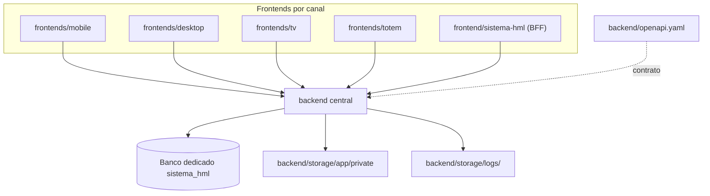

# Arquitetura Alvo

Atualizado em 24/06/2026.

A plataforma é organizada em quatro blocos principais:

## Backend central

- Fonte única de regras de negócio.
- Autenticação e autorização.
- API versionada em `/api/v1`.
- Contrato técnico oficial em `backend/openapi.yaml`.
- Controle de acesso a arquivos privados.
- Persistência no banco dedicado do ERP.

## Frontends por canal

- `frontends/mobile/` para PWA e uso prioritário no celular.
- `frontends/desktop/` para uso em tela maior.
- `frontends/tv/` e `frontends/totem/` para expansões futuras.
- `frontend/sistema-hml/` como frontend server-side/BFF do legado copiado, consumindo o backend central.
- Ambiente oficial de produção em VPS Linux (Ubuntu).

Nenhum frontend deve acessar banco diretamente. Quando um módulo for migrado, leitura, escrita, RBAC, workflow e arquivos operacionais passam obrigatoriamente pelo backend central.

## BFF do legado

`frontend/sistema-hml/` preserva a experiência server-side do CodeIgniter, mas não pode virar backend paralelo.

Regras:

- token Bearer somente em sessão server-side;
- comunicação com o backend por cliente HTTP único;
- sem regra de negócio duplicada;
- sem acesso direto ao banco em módulos migrados;
- sem anexos operacionais em pasta pública.

## Camada segura de arquivos e logs

- Fotos, PDFs e anexos ficam em `backend/storage/app/private`.
- Logs ficam em `backend/storage/logs`.
- Acesso a arquivo operacional é mediado pelo backend.
- Nada sensível depende de URL pública direta.

## Princípios de operação

- Frontend não acessa banco diretamente.
- Arquivo privado não é exposto por pasta pública.
- Qualquer novo canal consome a mesma API.
- `backend/routes/api.php` define o runtime atual.
- `backend/openapi.yaml` deve ficar sincronizado com as rotas reais.
- Specs e documentação explicam intenção, governança e critérios de evolução.
