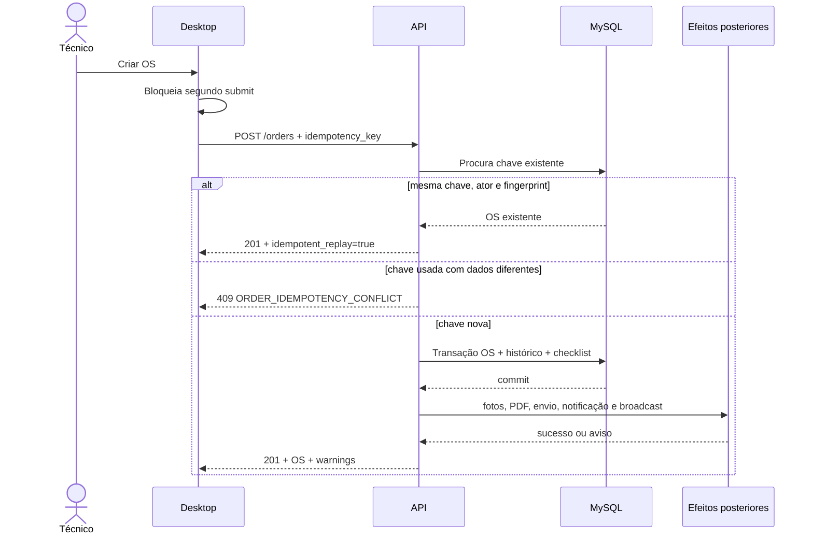

# Idempotência e confirmação segura na criação de OS

**Implementado em:** `5.1.0.0`  
**Migration:** `2026_07_20_000001_add_order_creation_idempotency.php`

## Objetivo

Garantir que uma mesma intenção de criação gere no máximo uma Ordem de Serviço,
inclusive quando o navegador repete o submit, a conexão cai depois do commit ou
uma etapa secundária falha após a gravação principal.

## Contrato

O formulário desktop gera um UUID em `idempotency_key` e o envia em
`POST /api/v1/orders`. O backend aceita a chave somente na criação; update a
proíbe.

O banco persiste em `os`:

| Coluna | Tipo | Uso |
|---|---|---|
| `creation_request_id` | UUID nullable, UNIQUE | identidade da tentativa |
| `creation_request_fingerprint` | CHAR(64) nullable | SHA-256 do ator e payload canônico |
| `creation_requested_by` | BIGINT unsigned nullable | usuário que iniciou a tentativa |

As colunas são nullable para manter compatibilidade com registros e
consumidores anteriores.

## Fluxo

## Fingerprint

O fingerprint inclui o ID do ator e o payload canônico, excluindo a própria
chave e os objetos de upload. Objetos associativos são ordenados
recursivamente antes do JSON e do SHA-256. `hash_equals` é usado na comparação.

Uploads não participam do fingerprint porque não são serializáveis e a OS já é
a unidade idempotente principal. Se a primeira tentativa criar a OS e falhar ao
anexar fotos, o replay recupera a mesma OS e informa o estado existente; não
cria uma segunda OS para tentar repetir anexos.

## Concorrência

A checagem anterior à escrita melhora o caminho comum, mas não é a garantia
final. O índice UNIQUE em `creation_request_id` arbitra requisições
simultâneas. Se a inserção perder a corrida, o serviço consulta a chave e
retorna o replay equivalente; qualquer outro erro de banco continua sendo
propagado.

## Efeitos posteriores ao commit

Somente OS, histórico inicial e checklist essencial pertencem à transação
principal. Depois do commit, as etapas abaixo são isoladas:

- persistência/catalogação das fotos;
- geração de PDF de abertura;
- envio do documento ao cliente;
- notificação interna;
- broadcast em tempo real;
- montagem da projeção detalhada da resposta.

Falha nessas etapas gera `warnings` e log estruturado com `order_id`, estágio e
classe da exceção. A resposta não registra mensagem interna, path, credencial
ou payload sensível. O sucesso da OS não é revertido nem mascarado por erro
secundário.

## Respostas

| Situação | HTTP/payload | UX |
|---|---|---|
| primeira criação | `201`, `idempotent_replay=false` | “Nova OS criada com sucesso” |
| repetição equivalente | `201`, `idempotent_replay=true` | “A OS já havia sido criada e foi recuperada com segurança” |
| chave com payload/ator diferente | `409 ORDER_IDEMPOTENCY_CONFLICT` | atualizar página e iniciar nova tentativa |
| efeito posterior falha | `201` com `warnings[]` | sucesso da OS + aviso específico |

## Segurança

- a chave é UUID validado, não segredo nem autorização;
- ator faz parte do fingerprint e é persistido separadamente;
- uma chave não pode recuperar OS de outro usuário com payload diferente;
- conflito devolve mensagem estável sem revelar dados da OS existente;
- o índice UNIQUE evita race condition;
- nenhuma exceção pós-commit é devolvida com stack trace.

## Performance e escala

- lookup da chave usa índice UNIQUE, O(log n);
- o SHA-256 é calculado sobre payload pequeno em memória;
- não há lock de tabela;
- múltiplas instâncias da API compartilham a mesma garantia no MySQL;
- a estratégia não depende de sessão local nem cache distribuído.

## Testes obrigatórios

- primeira criação com chave nova;
- replay equivalente retorna a mesma OS;
- mesma chave com payload diferente retorna `409`;
- falha concorrente no índice converge para replay;
- falha de notificação pós-commit retorna OS e warning;
- botão desktop bloqueia submit repetido;
- chave é mantida após erro de validação para retry equivalente.

## Rollback

O rollback operacional pode reverter frontend/API sem remover as colunas. A
migration só deve ser revertida em ambiente sem dados relevantes ou em janela
específica. Remover o índice durante incidente reabre a possibilidade de
duplicidade e não é o primeiro procedimento de resposta.
