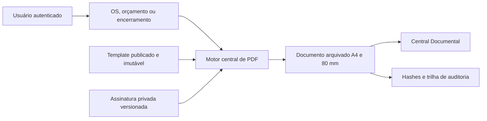

# Consolidado das implementações de 18 e 19 de julho de 2026

**Período:** 18/07/2026 a 19/07/2026  
**Versões:** `4.19.0.0` a `4.24.0.0`  
**Ambiente validado:** desenvolvimento LAN — `192.168.1.100`  
**Produção:** ainda não promovido à VPS

## Visão executiva

O período consolidou três frentes que compartilham o mesmo princípio: manter uma
fonte de verdade central, versionada e auditável.

| Frente | Resultado |
|---|---|
| Contas e Saldos | posição patrimonial por caixa, banco, adquirente e reserva, sem contaminar o DRE |
| Motor PDF | documentos operacionais gerados por templates declarativos, versionados e editáveis |
| Assinaturas | documentos humanos vinculam criador, sessão e signatário, com assinatura privada e rastreável |

## 1. Gestão de contas e saldos

### Entregas

- contas do tipo caixa, banco, adquirente, carteira e reserva;
- saldo inicial patrimonial, ajustes auditáveis e transferências atômicas;
- conta padrão por forma de pagamento;
- cartão líquido a receber até confirmação do crédito;
- extrato paginado e consolidado mensal;
- permissões `contas_saldos` independentes do módulo Financeiro;
- integração com baixas financeiras e fechamento da OS.

### Decisão arquitetural

O sistema não criou um segundo livro-caixa. O saldo é projetado a partir dos
movimentos financeiros existentes, somados aos movimentos puramente
patrimoniais. Transferências e saldo inicial não viram receita ou despesa.

### Correções do mesmo ciclo

- preservação da conta em lançamento já pago;
- validação da conta no fechamento da OS;
- correção de collation no extrato;
- sanitização de erros SQL retornados pela API.

Documento detalhado: `2026-07-18-gestao-contas-e-saldos-financeiros.md`.

## 2. Motor central de documentos PDF

### Entregas

- sete documentos nativos unificados no `PdfGenerationService`;
- criação de documentos personalizados do zero;
- clonagem independente para reaproveitar estrutura e trocar nomes;
- rascunho editável, publicação imutável, restauração e prévia;
- geração A4 e 80 mm pela mesma definição;
- blocos de título, parágrafo, HTML restrito, tabela, grade, observações,
  colunas, imagens e assinaturas;
- editor com maior espaço para configuração do bloco;
- quebras de linha e formatação de texto preservadas;
- variáveis do sistema validadas e nome fantasia com fallback seguro;
- cabeçalho 25/50/25: logo, empresa centralizada e foto do equipamento;
- rodapé A4 fora do fluxo do corpo para evitar páginas vazias;
- Termo de Garantia promovido por migration idempotente;
- responsável e cliente lado a lado no bloco de assinatura.

### Segurança

- variáveis escapadas e HTML rico sanitizado por allowlist;
- Dompdf sem PHP e sem acesso remoto;
- imagens apenas por tokens internos e arquivos privados validados;
- prevenção de path traversal na foto do equipamento;
- tipos-base e fontes de dados definidos por allowlist;
- nenhuma classe, SQL ou URL arbitrária pode ser cadastrada pelo editor.

Documento detalhado: `2026-07-18-motor-central-documentos-pdf.md`.

## 3. Assinaturas e identidade documental

### Entregas

- assinatura do usuário por upload PNG/JPG/WebP ou desenho em tela;
- suporte a Pointer Events, toque e Apple Pencil;
- confirmação da senha atual para cadastrar ou substituir;
- versões antigas preservadas para auditoria;
- assinatura própria e assinatura de outro usuário por reautenticação;
- sessão original mantida: criador, usuário da sessão e signatário não são confundidos;
- solicitação pendente atribuída a um responsável;
- caixa global de pendências no perfil e acesso pela Central Documental;
- assinatura do cliente por link responsivo de uso único;
- exigência de assinatura ativa para PDFs atribuídos a pessoas;
- status Cadastrada/Pendente na gestão de usuários.

### Segurança

- assinatura no armazenamento privado, normalizada em PNG e sem metadados;
- rejeição de SVG, URL externa, arquivo inválido e dimensões abusivas;
- senha verificada por hash e nunca persistida ou registrada em log;
- rate limit de cadastro e reautenticação;
- token público aleatório de 64 caracteres, persistido apenas em SHA-256;
- expiração, invalidação após uso e locks contra dupla submissão;
- hash do snapshot da OS bloqueia assinatura de dados alterados;
- IP e user-agent registrados somente como fingerprints.

Documento detalhado: `2026-07-19-assinaturas-digitais-documentos.md`.

## Migrations do período

Executar na ordem natural do Laravel:

1. `2026_07_18_000001_create_financeiro_contas_tables.php`
2. `2026_07_18_000002_seed_contas_saldos_module.php`
3. `2026_07_18_000010_create_pdf_templates_tables.php`
4. `2026_07_18_000011_seed_pdf_default_templates.php`
5. `2026_07_18_000012_seed_pdf_engine_permissions.php`
6. `2026_07_18_000013_publish_light_pdf_templates_v2.php`
7. `2026_07_18_000014_add_custom_pdf_template_support.php`
8. `2026_07_18_000014_fix_encerramento_recebimentos_data_format.php`
9. `2026_07_18_000015_standardize_pdf_template_headers.php`
10. `2026_07_18_000016_seed_termo_garantia_template.php`
11. `2026_07_19_000001_add_client_to_pdf_signature_blocks.php`
12. `2026_07_19_000002_create_document_signature_infrastructure.php`

No ambiente LAN, todas constam como executadas, até o batch 30.

## Checklist de deploy

1. gerar backup consistente do banco e do storage privado;
2. confirmar PHP com GD, Redis e permissões de escrita no storage;
3. publicar backend, desktop, migrations, assets e documentação juntos;
4. executar `php artisan migrate --force` no backend;
5. limpar e reconstruir caches de configuração, rotas e views;
6. garantir `DOCUMENT_SIGNATURES_REQUIRED=true`;
7. confirmar cache compartilhado Redis para os locks de assinatura;
8. cadastrar as assinaturas de todos os usuários ativos;
9. cadastrar e conciliar as contas financeiras reais;
10. validar abertura, orçamento, laudo, garantia e encerramento em A4/80 mm;
11. testar um fluxo pendente interno e um link de assinatura do cliente;
12. manter rollback de aplicação e banco disponível durante a janela.

## Validação e qualidade

- migrations aplicadas no desenvolvimento LAN;
- 28 testes principais de assinatura/PDF aprovados, com 222 asserções;
- testes de finanças, RBAC, transferências, extrato e fechamento da OS;
- compilação dos templates Blade e verificação das rotas;
- validação de hashes, publicação imutável e geração A4/80 mm;
- endpoint público de assinatura verificado por HTTPS local.

Uma execução ampla de orçamento encontrou dois casos afetados pela permissão
preexistente de `storage/app/private`, pertencente ao `www-data`, e não por
regressão funcional. A inspeção visual automatizada também ficou limitada pelo
certificado HTTPS autoassinado do ambiente LAN. Esses dois itens devem ser
repetidos no pipeline/deploy com usuário de serviço e certificado confiável.

## Performance e escalabilidade

- índices compostos para contas, movimentos e pendências;
- paginação e limites de período no extrato;
- `withExists` na situação de assinatura dos usuários, sem N+1;
- schema PDF cacheado por versão;
- imagens carregadas apenas quando o template usa o token correspondente;
- assinaturas limitadas e redimensionadas antes do Dompdf;
- serviços stateless, com lock distribuído em Redis para múltiplas instâncias.

## Riscos operacionais e próximas evoluções

- incluir o storage privado das assinaturas no backup e na política de retenção;
- não usar cache local em implantação com mais de uma instância;
- implantar notificações automáticas de pendências e painel de SLA;
- avaliar carimbo de tempo externo/ICP-Brasil para documentos que exijam maior força probatória;
- integrar extratos bancários/adquirentes por importação idempotente;
- remover o catálogo PDF legado somente após retenção e auditoria dos dados.

## Fontes de verdade

- versão atual: `VERSION` e `shared/version.php`;
- histórico detalhado: `CHANGELOG.md`;
- contrato de API: `backend/openapi.yaml`;
- modelos do banco: migrations versionadas;
- documentação técnica: arquivos citados neste consolidado.
