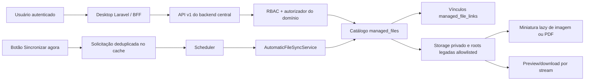

# Consolidado das implementações de 20 de julho de 2026

**Release:** `5.2.0.0`
**API:** `1.5.0`  
**Ambiente implantado e validado:** desenvolvimento LAN — `192.168.1.100`  
**Produção externa:** não promovida por esta entrega  
**Autor técnico:** Codex  
**Estado:** implementado, implantado no ambiente LAN e coberto por testes automatizados

## 1. Visão executiva

O trabalho do dia transformou o painel inicial do Gerenciador Central de
Arquivos em uma biblioteca operacional navegável, conectou o catálogo aos
arquivos que continuam sendo gravados pelos módulos legados e eliminou duas
fontes de duplicidade operacional: a repetição da criação de OS depois de uma
resposta ambígua e o retrabalho manual na matriz de permissões.

| Frente | Resultado entregue |
|---|---|
| Catálogo central | arquivos privados e legados descobertos, classificados e vinculados sem movimentar o binário de origem |
| Sincronização | execução automática agendada e solicitação manual assíncrona, ambas idempotentes e protegidas por lock |
| Biblioteca visual | pastas por categoria, grade/lista, miniaturas de imagem/PDF, seleção, ZIP, lixeira lógica, download e filtros |
| Visualização | imagens e PDFs abertos em modal interno; fotos possuem zoom/rotação e PDF usa iframe com controles nativos |
| Central documental da OS | coluna Foto mostra a primeira página da versão mais recente e acompanha a versão escolhida na linha |
| Contexto de negócio | cards e linhas exibem data real do documento e cliente vinculado quando o RBAC permite |
| Permissões | seleção individual, por módulo, por coluna e da matriz inteira, mantendo o backend como autoridade |
| Criação de OS | chave de idempotência ponta a ponta, proteção contra clique duplo e resposta de sucesso mesmo se uma etapa posterior falhar |
| Sessão e logs | falha transitória de sincronização do perfil não cria loop de login para sessão válida; logs usam `0664` |

## 2. Arquitetura da entrega

O desktop permanece um BFF: ele não acessa banco ou storage diretamente. O
backend central resolve catálogo, vínculo, autorização e entrega do conteúdo.



### Decisões centrais

1. O catálogo registra arquivos existentes pelo caminho relativo allowlisted;
   não move, renomeia ou exclui o binário durante a sincronização.
2. UUID é identificador, não autorização. Toda entrega valida o vínculo com o
   domínio de origem.
3. Miniaturas e previews são carregados sob demanda. A listagem não transporta
   os documentos completos.
4. Exclusão no painel significa transição auditável para `trashed`; não há
   purga física.
5. A criação da OS confirma primeiro a escrita transacional principal. Falhas
   posteriores viram avisos e não convertem uma OS já criada em erro genérico.

## 3. Gerenciador Central de Arquivos

### 3.1 Catálogo e cobertura de arquivos

O scanner percorre apenas aliases configurados em `config/file-manager.php`.
A cobertura ativa inclui:

- fundo de login e logo da empresa;
- fotos de equipamentos;
- fotos de OS;
- PDFs e documentos de OS;
- PDFs de orçamentos;
- assinaturas e fotos de usuários;
- anexos do chat;
- roots legadas de equipamentos, OS, checklists, acessórios, documentos,
  orçamentos, chat, WhatsApp, usuários e sistema.

Cada entrada catalogada registra UUID, nome original, nome seguro, extensão,
MIME detectado, tamanho, SHA-256, disk, storage key relativo, categoria, origem
e estados independentes de lifecycle, integridade, segurança e migração.

### 3.2 Sincronização automática

`AutomaticFileSyncService` executa o fluxo abaixo para cada root:

1. valida modo, switches e alias da root;
2. adquire lock global no cache;
3. cria um `FileScanRun` com heartbeat e fingerprint das roots;
4. executa scanner limitado e sem seguir symlink;
5. cataloga findings elegíveis de forma idempotente;
6. reconcilia vínculos de fotos/documentos com equipamentos e OS;
7. persiste contadores e estado terminal por root;
8. libera o lock; o TTL continua como proteção se a liberação falhar.

Uma root inexistente é marcada como `not_found` e não interrompe as demais.
Falhas são isoladas por root e a execução termina como
`completed_with_errors` quando houver resultado parcial.

O scheduler executa:

```text
file-manager:sync --pending   a cada minuto
file-manager:sync             no intervalo configurado, padrão de 5 minutos
```

### 3.3 Sincronização manual

O botão **Sincronizar agora** não executa uma varredura longa dentro do
PHP-FPM. Ele exige `arquivos:administrar`, sofre rate limit e grava uma
solicitação deduplicada no cache por até dez minutos. O scheduler consome a
solicitação em até um minuto.

Se uma sincronização automática bem-sucedida já tiver terminado depois do
clique, a solicitação manual é satisfeita pela execução existente. Se houver
lock, a solicitação volta ao cache para nova tentativa.

### 3.4 Biblioteca em grade e lista

O desktop oferece:

- pastas por categoria e lixeira;
- filtros de nome/UUID, categoria e localização lógica;
- grade responsiva e tabela em modo lista;
- seleção individual ou de toda a página;
- download individual;
- download de até 50 arquivos em ZIP temporário de até 100 MiB;
- exclusão individual/em lote para a lixeira lógica;
- paginação e contadores por categoria;
- indicação de lifecycle do arquivo.

No modo lista foram adicionadas as colunas **Foto** e **Cliente**. A miniatura
fica no início da linha. O cliente é resolvido em lote por vínculos de OS,
equipamento ou cliente, evitando N+1 e respeitando as permissões do usuário.

### 3.5 Data do documento e cliente vinculado

O vínculo reconciliado guarda `source_created_at`. A API expõe:

- `document_created_at`: menor data válida das fontes ativas do documento;
- fallback para `managed_files.created_at` quando o legado não possui data;
- `linked_client`: somente quando o usuário também pode visualizar o domínio
  de origem.

Data inválida em metadado legado é ignorada e não derruba a listagem.

### 3.6 Miniaturas

Imagens utilizam a própria rota de preview autenticada. PDFs possuem miniatura
da primeira página gerada pelo Poppler (`pdftocairo`) sob demanda.

O cache de PDF é identificado por SHA-256 e dimensão, portanto uma alteração
real do conteúdo gera outra chave. O processo:

- exige arquivo `active + valid + clean` e autorização de domínio;
- executa o binário por lista de argumentos, sem shell;
- possui timeout, lock por hash e limite de tamanho/dimensão;
- valida a saída com `getimagesize` e MIME `image/png`;
- grava temporário e promove por rename;
- serve cache privado com ETag e `nosniff`;
- limita a rota por rate limit.

No navegador, as miniaturas PDF são carregadas de forma lazy e com concorrência
limitada. Uma falha de miniatura mantém um ícone de fallback, sem quebrar a
biblioteca.

### 3.7 Visualizador em modal

O botão de olho e as miniaturas abrem o documento na própria tela.

Para imagens, o modal oferece:

- ampliar e reduzir;
- voltar a 100%;
- ajustar à área disponível;
- girar para esquerda/direita;
- arrastar a imagem ampliada;
- atalhos de teclado e `Ctrl + roda do mouse`;
- tela cheia e download.

Para PDFs, o modal utiliza iframe same-origin com a barra nativa do navegador,
recarregar, tela cheia e download. O `src` começa em `about:blank`, só recebe a
rota segura depois do clique e volta a `about:blank` ao fechar. Isso reduz
memória, requisições e exposição desnecessária do conteúdo.

### 3.8 Entrega segura e correções de visualização

O backend e o BFF preservam `Content-Type`, `Content-Disposition`, ETag e
cache quando aplicável, acrescentando `X-Content-Type-Options: nosniff`.
Previews usam `private, no-store` e CSP sandbox.

As rotas de fotos de OS/equipamento passaram a resolver primeiro o storage
privado atual e depois candidatos legados allowlisted. A consulta confirma que
a foto pertence à OS/equipamento solicitado, impedindo IDOR. O frontend converte
URLs do backend em rotas proxy autenticadas do próprio desktop, corrigindo as
miniaturas quebradas nas telas de criação e edição de OS.

### 3.9 Miniatura na Central Documental da OS

A tabela em `/os/{order}/documentos` ganhou a coluna **Foto**. Cada linha usa o
PDF A4 da versão mais recente como estado inicial e exibe sua primeira página.
Ao escolher outra versão no seletor, miniatura, link, texto alternativo e ações
passam a apontar para o documento selecionado sem recarregar a página.

A entrega usa uma rota de domínio dedicada no backend e outra no BFF desktop.
Ambas exigem `os:visualizar`; o usuário não precisa receber a permissão
administrativa `arquivos:baixar`. Antes de renderizar, o backend valida que o
documento pertence à OS solicitada e delega ao `PdfThumbnailService` os estados
de lifecycle/integridade/segurança, a contenção do caminho e o cache por
SHA-256. A imagem usa lazy loading, resposta privada, ETag e `nosniff`.

Quando a versão ainda não possui PDF, o arquivo gerenciado está bloqueado ou o
binário não está disponível, a célula mantém um ícone de fallback e não expõe
caminhos internos nem mensagens técnicas. A renderização depende de
`poppler-utils` (`pdftocairo`) no host do backend.

## 4. Matriz de permissões

A matriz RBAC agora permite quatro níveis de edição:

1. checkbox individual para cada permissão;
2. selecionar/desmarcar todas as permissões de um módulo;
3. selecionar/desmarcar toda uma coluna de permissão;
4. marcar ou desmarcar a matriz inteira.

Os rótulos, ícones, `aria-pressed` e estados habilitado/desabilitado são
sincronizados após cada alteração. A limpeza global exige confirmação. Grupos
de sistema e usuários sem `grupos:editar` continuam com controles bloqueados.

Essa automação atua apenas na interface. A alteração só é persistida ao clicar
em **Salvar matriz de permissões**, e o backend continua sendo a autoridade
final para validar módulos, ações e grupos imutáveis.

O módulo `arquivos` possui permissões independentes:

| Permissão | Capacidade |
|---|---|
| `listar` | acessar catálogo e dashboard |
| `metadados` | abrir detalhe, vínculos, eventos e findings |
| `baixar` | preview, miniatura e download |
| `excluir` | mover arquivos para `trashed` |
| `quarentenar` | bloquear arquivo suspeito |
| `restaurar` | restaurar lifecycle permitido |
| `administrar` | sincronizar e executar ações administrativas autorizadas |

## 5. Criação idempotente de Ordem de Serviço

### Problema corrigido

A OS podia ser gravada corretamente, mas uma falha posterior — geração/envio
do PDF, notificação, broadcast ou montagem da resposta — fazia o desktop exibir
erro genérico. O técnico interpretava a mensagem como falha total e repetia a
operação, criando OS duplicadas.

### Solução

Cada formulário novo recebe um UUID `idempotency_key`. O backend persiste:

- `creation_request_id` com índice UNIQUE;
- `creation_request_fingerprint` SHA-256 do payload canônico e do ator;
- `creation_requested_by`.

Uma repetição com a mesma chave, mesmo ator e mesmo fingerprint retorna a OS já
criada com `idempotent_replay=true`. A mesma chave com dados diferentes retorna
`409 ORDER_IDEMPOTENCY_CONFLICT`. O índice UNIQUE resolve também a corrida entre
duas requisições simultâneas.

No navegador, o botão é desabilitado no primeiro submit e exibe estado de
processamento. Essa proteção melhora a UX, mas a garantia real permanece no
banco e no backend.

### Separação entre commit e efeitos posteriores

A criação principal, o histórico inicial e o checklist entram na transação.
Depois do commit:

- falha ao anexar fotos gera aviso;
- falha na notificação interna gera aviso;
- falha no envio do PDF ao cliente gera aviso;
- falha de broadcast é registrada sem invalidar a criação;
- falha na projeção detalhada devolve ao menos o ID confiável para redireção.

O desktop apresenta sucesso da OS e avisos específicos, evitando o falso
negativo que provocava duplicidade.

## 6. Sessão e operação de logs

O middleware do desktop passou a distinguir sessão inválida de indisponibilidade
transitória do endpoint de perfil:

- sessão sem token ou sem snapshot de autorização continua falhando fechada;
- sessão válida com snapshot preserva apenas a navegação durante erro
  transitório;
- cada chamada à API ainda é autorizada pelo backend central;
- o incidente é registrado sem token ou dados sensíveis.

Isso eliminou o ciclo `/login -> /dashboard -> /login` observado durante falha
transitória/permissão de leitura da aplicação.

Os canais diários do backend e desktop criam logs com modo `0664`: escrita para
owner e grupo operacional, sem permissão pública e sem `0777`.

## 7. Contrato HTTP relevante

Todos os endpoints abaixo estão sob `/api/v1`, autenticação Bearer e RBAC:

| Método | Endpoint | Uso |
|---|---|---|
| `GET` | `/file-manager/dashboard` | totais, categorias, flags e última sincronização |
| `POST` | `/file-manager/sync` | solicita sincronização manual; retorna `202` quando enfileirada |
| `GET` | `/file-manager/scan-runs` | histórico paginado de execuções |
| `GET` | `/file-manager/findings` | findings paginados e mascarados |
| `GET` | `/files` | catálogo paginado com cliente/data do documento |
| `GET` | `/files/{uuid}` | metadados, vínculos, eventos, findings e capacidades |
| `GET` | `/files/{uuid}/download` | download autenticado |
| `GET` | `/files/{uuid}/preview` | preview inline allowlisted |
| `GET` | `/files/{uuid}/thumbnail` | PNG da primeira página de PDF |
| `POST` | `/files/download-batch` | ZIP temporário de arquivos autorizados |
| `POST` | `/files/trash-batch` | lixeira lógica com step-up |
| `POST` | `/files/{uuid}/archive` | arquivamento lógico |
| `POST` | `/files/{uuid}/restore` | restauração lógica |
| `POST` | `/files/{uuid}/quarantine` | quarentena lógica |
| `POST` | `/files/{uuid}/release-quarantine` | liberação com referência de validação |
| `POST` | `/orders` | criação de OS com `idempotency_key` |

Respostas administrativas não devolvem storage key, path absoluto, senha de
step-up ou conteúdo dos arquivos em JSON.

## 8. Migrations e compatibilidade

Migrations associadas ao pacote:

1. `2026_07_19_000007_create_managed_file_infrastructure.php`;
2. `2026_07_19_000008_add_managed_file_uuid_to_order_document_files.php`;
3. `2026_07_19_000009_seed_file_manager_permissions.php`;
4. `2026_07_19_000010_add_file_manager_delete_permission.php`;
5. `chat/2026_07_19_000003_add_managed_file_uuid_to_message_attachments.php`;
6. `2026_07_20_000001_add_order_creation_idempotency.php`.

Todas são aditivas. Nenhum path ou campo legado foi removido. Em incidente, o
rollback primário é por configuração/feature flag; não se deve dropar catálogo
ou colunas que já possam conter referências.

## 9. Configuração operacional

Configuração recomendada para observação/catálogo no ambiente LAN:

```dotenv
FILE_MANAGER_MODE=shadow
FILE_MANAGER_ENABLED_CATEGORIES=company_login_background,company_logo,equipment_photo,order_photo,order_pdf,budget_pdf,user_signature,user_profile_photo,chat_attachment
FILE_MANAGER_ALLOW_WRITES=false
FILE_MANAGER_ALLOW_SCANNER=true
FILE_MANAGER_ALLOW_MUTATING_RECONCILE=true
FILE_MANAGER_ALLOW_ADMIN_STATE_MUTATIONS=false
FILE_MANAGER_AUTOMATIC_SYNC_ENABLED=true
FILE_MANAGER_AUTOMATIC_SYNC_INTERVAL_MINUTES=5
FILE_MANAGER_AUTOMATIC_SYNC_SCAN_LIMIT=10000
FILE_MANAGER_AUTOMATIC_SYNC_CATALOG_LIMIT=10000
FILE_MANAGER_AUTOMATIC_SYNC_DOMAIN_LINK_LIMIT=10000
FILE_MANAGER_AUTOMATIC_SYNC_MAX_DEPTH=12
FILE_MANAGER_AUTOMATIC_SYNC_LOCK_SECONDS=3600
FILE_MANAGER_PDF_THUMBNAILS_ENABLED=true
FILE_MANAGER_PDF_THUMBNAIL_RENDERER=/usr/bin/pdftocairo
FILE_MANAGER_PDF_THUMBNAIL_MAX_DIMENSION=480
FILE_MANAGER_PDF_THUMBNAIL_MAX_BYTES=2097152
FILE_MANAGER_PDF_THUMBNAIL_TIMEOUT_SECONDS=10
FILE_MANAGER_PDF_THUMBNAIL_CACHE_SECONDS=86400
```

`FILE_MANAGER_ALLOW_ADMIN_STATE_MUTATIONS` deve continuar `false` até que
archive, lixeira e quarentena sejam formalmente liberados. Ativar sincronização
não autoriza escrita central dos módulos nem exclusão física.

## 10. Segurança

### Ameaças tratadas

- **IDOR/Broken Access Control:** UUID sempre combinado com authorizer do
  domínio e RBAC.
- **Path Traversal/Symlink:** storage keys relativos, canonicalização e roots
  allowlisted; scanner não segue symlink.
- **MIME spoofing/XSS:** `finfo`, decoder de imagem, assinatura `%PDF-`,
  allowlist e `nosniff`; conteúdo ativo não é preview inline.
- **Command Injection:** Poppler é executado por `Process` com argumentos
  separados, caminho do binário validado e sem shell.
- **CSRF:** mutações do desktop continuam sob middleware CSRF.
- **Credential leakage:** `admin_password` não entra em flash/old input,
  eventos ou logs.
- **Race condition:** locks de sincronização/miniatura, índices UNIQUE e
  idempotência de criação da OS.
- **DoS:** paginação máxima, limites de lote/bytes/profundidade/tempo, rate
  limits e carregamento lazy.

### Riscos residuais

- `NullMalwareScanner` é um ponto de integração, não um antivírus real;
- o certificado HTTPS autoassinado do ambiente LAN continua gerando alerta e
  impediu o teste visual automatizado; deve ser substituído por certificado de
  uma CA confiável interna ou pública;
- backup e restauração conjuntos de banco principal, banco `chat`, catálogo e
  storage ainda precisam de ensaio operacional formal;
- purga física, retenção destrutiva e deduplicação permanecem fora do escopo;
- modo `hybrid` por categoria exige gate e janela próprios.

## 11. Performance e escalabilidade

- hashes e cópias usam stream com memória aproximadamente O(1);
- catálogo e findings são paginados e indexados;
- clientes são resolvidos em consultas em lote, sem uma query por arquivo;
- miniaturas PDF são cacheadas por hash e protegidas contra renderização
  concorrente duplicada;
- o iframe e a imagem do modal são descarregados ao fechar;
- sincronização roda fora da requisição web e pode usar cache distribuído;
- serviços são stateless; storage continua atrás de contrato substituível;
- em escala horizontal, Redis compartilhado é obrigatório para locks e
  solicitações manuais.

## 12. Testes e evidências

Cobertura implementada inclui:

- núcleo, paths, estados, idempotência, scanner, catálogo legado e links;
- sincronização automática, lock, root inexistente, falha isolada e solicitação
  manual;
- catálogo/painel, IDOR, headers, step-up, lixeira, ZIP e CSRF;
- miniatura PDF, cache seguro e fallback visual;
- grade/lista, modal, cliente vinculado e data do documento;
- matriz RBAC por módulo, coluna, global e checkbox individual;
- criação/replay/conflito idempotente de OS e falhas pós-commit;
- fotos privadas atuais e legadas de OS/equipamento.

Validação direcionada executada no ambiente LAN em 20/07/2026:

| Escopo | Resultado |
|---|---:|
| Backend do Gerenciador (`tests/Feature/Files` e `tests/Unit/Services/Files`) | 57 testes, 297 asserções |
| Frontend do Gerenciador + matriz RBAC | 13 testes, 95 asserções |
| Idempotência, conflito, pós-commit e fotos privadas da OS | 4 testes, 30 asserções |
| Envio simples e multipart da nova OS no desktop | 2 testes, 8 asserções |
| **Total direcionado aprovado** | **76 testes, 430 asserções** |

As suítes amplas também foram executadas como verificação exploratória. Elas
mantêm falhas preexistentes e fora do escopo desta release em expectativas do
documento de abertura, configuração do coletor de equipamentos e textos/layouts
antigos do `DesktopFrontendTest`. Essas falhas não atingem os testes direcionados
acima, mas devem ser tratadas em uma atividade separada antes de o projeto adotar
o status de suíte global totalmente verde.

## 13. Deploy

Ordem segura:

1. backup conjunto do banco principal, banco `chat` e storage;
2. publicar backend, desktop, assets e documentação da mesma versão;
3. executar migrations do backend principal;
4. executar a migration da conexão `chat` com grant mínimo;
5. instalar/confirmar `pdftocairo` no path configurado;
6. limpar caches de configuração, rota e view;
7. reconstruir o cache de views;
8. validar `schedule:list` e cron do Laravel;
9. executar `file-manager:diagnose --json`;
10. executar sincronização controlada por uma root e comparar contadores;
11. validar grade, lista, miniatura, modal, download e uma OS idempotente;
12. monitorar logs, `file_scan_runs` e findings.

Comandos de verificação:

```bash
cd /var/www/sistema-erp/backend
php artisan migrate:status
php artisan schedule:list
php artisan file-manager:diagnose --json
php artisan file-manager:sync --status
php artisan file-manager:sync --root=order_photos

cd /var/www/sistema-erp/frontends/desktop
php artisan optimize:clear
php artisan view:cache
php artisan test tests/Feature/Desktop/FileManagerTest.php
php artisan test tests/Feature/Desktop/GroupPermissionsTest.php
```

### Evidência do rollout na VPS

Em 20/07/2026, a VPS `161.97.93.120` estava com o código e as migrations da
release, porém o `.env` real ainda preservava os defaults seguros (`mode=off` e
sincronização desativada). O cron do Laravel já existia sob `www-data`.

Após backup validado do banco e do `.env`, foi aplicado o modo `shadow`, com
scanner e reconciliação habilitados, mas escrita central e mutações
administrativas mantidas desligadas. Resultado da primeira execução:

- 573 arquivos processados;
- 566 arquivos catalogados;
- 7 arquivos rejeitados pela política e preservados na origem;
- 320 arquivos associados a registros de domínio;
- 366 vínculos ativos criados;
- nenhuma root parcial ou com falha.

A segunda execução processou as mesmas 573 entradas sem gerar novo finding ou
novo registro, confirmando idempotência. O scheduler permaneceu ativo a cada
minuto e a sincronização completa configurada a cada cinco minutos.

### Incidente de branch no ambiente LAN

Durante a publicação da release, o commit `d762221` foi criado e enviado para
`develop`, mas a promoção foi interrompida depois do checkout de `main`. Como o
diretório Git também é o diretório servido pelo Nginx, a LAN passou a exibir
temporariamente a versão `4.26.3.0`. O ambiente foi restaurado para `develop`.

O publicador foi alterado para executar merge e push de `main` em um worktree
temporário sob `/tmp`. Assim, falha, desconexão ou cancelamento da promoção não
muda mais os arquivos servidos em `192.168.1.100`.

Um backup nomeado como `.env.before-*` também foi incluído indevidamente no
commit porque o filtro anterior bloqueava apenas o nome exato `.env`. O arquivo
foi removido do estado ativo, os padrões `.env.*` passaram a ser ignorados e o
guard do deploy passou a recusar variantes de `.env`, preservando apenas
arquivos `*.example`. A limpeza do histórico e a rotação das credenciais devem
ser concluídas antes de promover essa linha para `main`.

## 14. Rollback

### Gerenciador e sincronização

1. definir `FILE_MANAGER_AUTOMATIC_SYNC_ENABLED=false`;
2. definir `FILE_MANAGER_MODE=off` e `FILE_MANAGER_ALLOW_WRITES=false`;
3. manter `FILE_MANAGER_ALLOW_ADMIN_STATE_MUTATIONS=false`;
4. limpar cache de configuração;
5. confirmar leitura pelos endpoints legados;
6. preservar catálogo, aliases, vínculos, eventos, findings e miniaturas para
   investigação; não apagar em massa.

### Interface

Reverter as views/assets/BFF para o pacote anterior não exige rollback do
banco. Os endpoints novos podem permanecer inacessíveis por RBAC/flag.

### Idempotência da OS

Em incidente de aplicação, voltar o código não exige remover as três colunas.
Não reutilizar uma `creation_request_id` com payload diferente. Uma remoção de
índice/colunas só pode ocorrer em janela própria depois de confirmar ausência
de dependência e dados relevantes.

## 15. Trade-offs e próximas melhorias

- A miniatura PDF síncrona sob demanda simplifica operação e evita fila
  adicional; em volume elevado, pode migrar para geração assíncrona com fila e
  pré-aquecimento controlado.
- O catálogo mantém compatibilidade de paths, aumentando temporariamente a
  quantidade de resolvers; remover fallback agora seria mais simples, porém
  eliminaria o rollback seguro.
- A solicitação manual via cache dispensa worker dedicado, mas depende do
  scheduler e de cache compartilhado em múltiplas instâncias.
- Cliente vinculado foi limitado a OS/equipamento/cliente conhecidos. Outros
  domínios devem ganhar reconciliador e authorizer explícitos, nunca inferência
  genérica por nome de arquivo.
- Próximas prioridades: certificado confiável, teste formal de restore,
  alertas externos, antivírus real e teste de carga de catálogo/miniaturas.

## 16. Fontes de verdade

- arquitetura: `documentacao/03-arquitetura-tecnica/gerenciador-central-arquivos.md`;
- operação: `documentacao/10-deploy/operacao-gerenciador-central-arquivos.md`;
- segurança de arquivos: `documentacao/01-fundacao/acesso-seguro-a-arquivos.md`;
- contrato oficial: `backend/openapi.yaml`;
- especificação e rollback: `specs/022-gerenciador-central-arquivos/`;
- versão: `VERSION` e `shared/version.php`;
- histórico: `CHANGELOG.md`.
