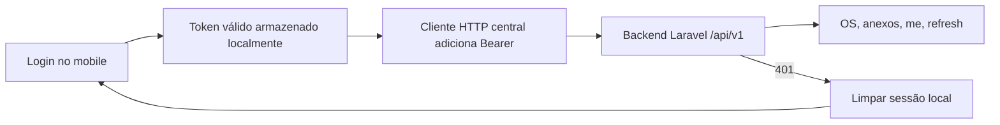

# Plan: Sessão e segurança do PWA mobile

## Contexto Técnico

- Backend central: Laravel 13.x
- API pública: `/api/v1`
- Autenticação: token Bearer emitido pelo backend e enviado pelo app mobile
- Frontend mobile: Next.js em `frontends/mobile/`
- Persistência de sessão: armazenamento local do navegador do canal mobile
- Segurança do navegador: `Content-Security-Policy` restritiva em `next.config.ts`
- Acesso a OS e anexos: apenas via endpoints do backend central

## Decisões Fixas

- O canal mobile usa token Bearer, não cookie httpOnly.
- A sessão fica persistida no frontend enquanto o token estiver válido.
- O login deve gravar token, expiração e dados mínimos do usuário para reidratação.
- O app deve validar a sessão ao abrir e tratar `401` limpando o estado local.
- O backend deve emitir token com expiração real de 7 dias no login e no refresh, com `expiresAt` definido explicitamente no `createToken`.
- O refresh deve consumir o endpoint existente `POST /api/v1/auth/refresh`, revogar o token atual e emitir outro com nova validade.
- O logout deve revogar o token atual no backend e limpar a sessão no frontend.
- A política de segurança do Next.js deve bloquear origens externas por padrão e liberar apenas a API necessária.
- Em desenvolvimento, a CSP deve permitir o origin local da API; em produção, deve ficar restritiva.
- O fluxo de OS do mobile consome os endpoints já existentes no backend central.
- Não haverá novo modelo de dados persistido para sessão neste ciclo.

## Fluxo Previsto

## Estrutura de Implementação

### Backend

- `backend/app/Http/Controllers/Api/V1/AuthController.php`
- `backend/config/sanctum.php`
- `backend/routes/console.php`
- `backend/tests/Feature/Api/V1/AuthFlowTest.php`

### Frontend mobile

- `frontends/mobile/package.json`
- `frontends/mobile/next.config.ts`
- `frontends/mobile/.env.example`
- `frontends/mobile/README.md`
- `frontends/mobile/src/app/layout.tsx`
- `frontends/mobile/src/app/page.tsx`
- `frontends/mobile/src/app/login/page.tsx`
- `frontends/mobile/src/app/os/page.tsx`
- `frontends/mobile/src/app/os/[id]/page.tsx`
- `frontends/mobile/src/components/auth-guard.tsx`
- `frontends/mobile/src/components/logout-button.tsx`
- `frontends/mobile/src/components/orders/`
- `frontends/mobile/src/lib/api.ts`
- `frontends/mobile/src/lib/session.ts`
- `frontends/mobile/src/lib/orders.ts`

### Documentação

- `README.md`
- `documentacao/README.md`
- `documentacao/01-fundacao/contrato-de-ambiente.md`
- `documentacao/03-arquitetura-tecnica/README.md`
- `documentacao/03-arquitetura-tecnica/backend-central-minimo.md`
- `documentacao/07-novas-implementacoes/`

## Riscos e Mitigações

- **Risco**: token sem expiração efetiva.
  - **Mitigação**: definir `expiresAt` no login e no refresh, e validar em teste.
- **Risco**: vazamento de token em console ou storage dump.
  - **Mitigação**: nunca logar token e limpar a sessão em erro de autenticação.
- **Risco**: CSP quebrar o desenvolvimento do Next.js.
  - **Mitigação**: diferenciar `development` e `production`, mantendo a política mínima necessária.
- **Risco**: app depender de script externo no futuro.
  - **Mitigação**: bloquear por padrão e documentar qualquer exceção.
- **Risco**: o frontend mobile virar uma auth acoplada ao framework web.
  - **Mitigação**: manter o contrato Bearer estável e centralizado no backend.

## Validação

- `php artisan test --filter=AuthFlowTest` no backend.
- `php artisan test` para garantir que as alterações não quebraram o fluxo atual.
- `npm run lint` e `npm run build` no `frontends/mobile/`.
- Smoke manual do fluxo login -> reabrir app -> listar OS -> detalhe -> logout.
- Verificação manual da `CSP` no navegador e no modo de desenvolvimento.

## Critério de Saída

Esta fase só estará concluída quando o técnico conseguir autenticar no mobile, manter a sessão enquanto válida, recuperar o app sem novo login, consumir o fluxo de OS com anexos controlados e sair com revogação real do token, tudo com documentação atualizada e política de segurança aplicada.
