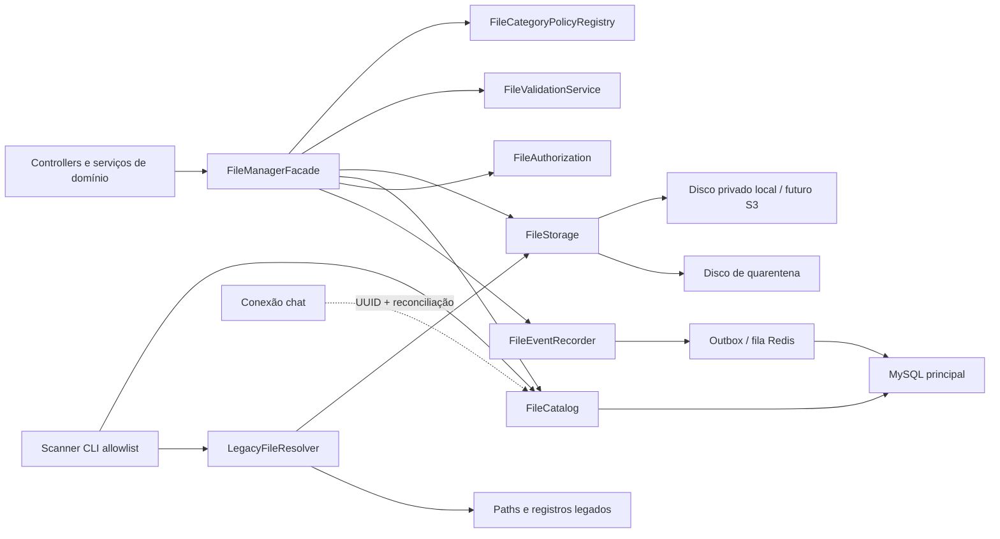
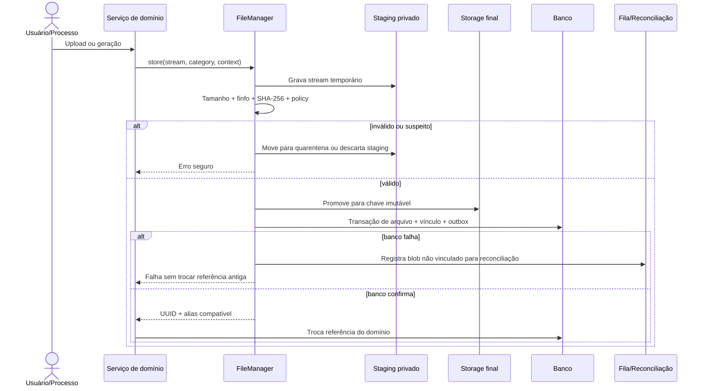

# Implementation Plan: Gerenciador Central de Arquivos

**Branch**: `develop` | **Date**: 2026-07-19 | **Spec**: [spec.md](./spec.md)

**Input**: infraestrutura central de arquivos funcionais com migração incremental, compatibilidade e rollback obrigatório.

## Summary

O trabalho será entregue como uma iniciativa multi-release, nunca como substituição integral. Primeiro serão corrigidos riscos imediatos e criado um inventário somente leitura. Depois será implementado um núcleo pequeno, sem regras de domínio, operando em `observe`/`shadow`. A escrita será validada inicialmente no fundo de login, mantendo caminho compatível com o leitor atual. Logo, fotos, documentos de OS e chat serão migrados em ondas independentes. Scanner avançado, painel, retenção e deduplicação ficam condicionados à estabilidade do núcleo.

## Technical Context

**Language/Version**: PHP `^8.3`, runtime PHP 8.5, Laravel 13

**Primary Dependencies**: Laravel Storage/Flysystem, Eloquent, Sanctum/RBAC, Redis, queue/scheduler, Dompdf

**Storage**: MySQL 8.4; conexão adicional `chat`; filesystem privado local; disco `legacy_public`; S3 disponível apenas como configuração futura

**Testing**: PHPUnit 12, testes Feature/Unit, `Storage::fake`, fixtures reais controladas em Linux

**Target Platform**: Ubuntu Linux, Nginx, PHP-FPM, Supervisor e Redis

**Project Type**: monorepo web; backend API central e BFF desktop

**Performance Goals**: streaming com memória constante; overhead p95 inferior a 10% no piloto; listagens paginadas; scanner fora da requisição web

**Constraints**: banco real compartilhado com legado; migrations apenas aditivas; contratos atuais retrocompatíveis; nenhuma indisponibilidade planejada na ativação

**Scale/Scope**: 24 arquivos da aplicação atualmente manipulam arquivos diretamente; rotas de chat, OS, PDF, assinaturas, fotos, branding e import/export são impactadas; volume definitivo depende do inventário

## Constitution Check

- Backend central permanece fonte única de verdade para storage e autorização: **PASS**.
- Frontends não recebem caminho físico nem acesso direto ao storage: **PASS**.
- Arquivos operacionais permanecem privados: **PASS**.
- API e documentação serão atualizadas por release: **PASS**.
- Migrations serão aditivas e reversão operacional ocorrerá por configuração: **PASS**.
- pt-BR/UTF-8 e ambiente Ubuntu serão preservados: **PASS**.
- Nenhuma regra de OS, assinatura ou chat será duplicada no núcleo: **PASS**.
- Operações destrutivas permanecerão desligadas até projeto posterior: **PASS**.

## Baseline confirmada

- `config/filesystems.php` define `local` em `storage/app/private` e `legacy_public` para leitura transitória.
- Há chaves atuais com prefixo `private/`, resultando em caminhos físicos `private/private/...`; isso será tratado como compatibilidade, não “corrigido” por movimentação imediata.
- `OrderDocumentCenterService` já controla versões, arquivos por formato, links públicos, arquivo lógico, envio e autorização de documentos da OS.
- `MessageAttachmentService` grava anexos na conexão principal de storage, enquanto seus modelos usam a conexão `chat`.
- O chat aceita tipos amplos e atualmente pode servir conteúdo inline; branding aceita SVG público inline; essas correções não esperarão a migração completa.
- PDFs, assinaturas, logo e fotos já possuem regras especializadas que devem virar clientes do núcleo, não ser reimplementadas nele.

## Princípios de arquitetura

1. **Arquivo físico imutável**: uma substituição cria novo registro/blob; não sobrescreve bytes referenciados.
2. **Regra por categoria**: logo, foto, PDF, assinatura e anexo possuem políticas diferentes.
3. **Autorização por domínio**: saber o UUID não concede acesso; o vínculo determina a policy responsável.
4. **Compatibilidade antes de canonicidade**: o primeiro write path continua legível pelo fluxo antigo.
5. **Fail-open somente no shadow**: observação não interrompe o legado; escrita central falha fechada antes de trocar referência.
6. **Sem transação fictícia**: filesystem e bancos diferentes exigem staging, compensação e reconciliação.
7. **Sem scanner global**: cada trust zone possui raiz, política e lifecycle próprios.
8. **Sem estado monolítico**: ciclo de vida, integridade, segurança e migração são independentes.
9. **Sem endpoint genérico de upload no MVP**: o módulo continua validando contexto e finalidade.
10. **Sem exclusão como rollback**: rollback desativa caminhos novos e preserva todos os artefatos.

## Arquitetura alvo



### Responsabilidades

#### `FileManagerFacade`

- expõe casos de uso pequenos: `store`, `resolve`, `stream`, `link`, `unlink`, `quarantine`;
- coordena serviços; não implementa regras de OS/chat/PDF;
- recebe `FileContext` tipado com categoria, ator e referência de domínio.

#### `FileStorage`

- abstração sobre Laravel Storage;
- `stage`, `promote`, `openReadStream`, `deleteStaging`, `exists`, `checksum`;
- não recebe caminho absoluto de controller;
- provider local primeiro; contrato compatível com S3 depois.

#### `FileValidationService`

- valida erro, tamanho e ausência de conteúdo vazio;
- detecta MIME real por `finfo` e decodificador quando necessário;
- compara extensão, MIME e política versionada;
- normaliza imagens raster quando a categoria exigir;
- nunca executa, inclui ou descompacta arquivos.

#### `FileCatalog`

- persiste metadados, aliases, links e estados;
- garante idempotência por operation key;
- não lê binário para listagens;
- fornece queries paginadas e indexadas.

#### `FileAuthorization`

- resolve um autorizador registrado para `subject_type` allowlisted;
- delega OS, conversa, equipamento, configuração e assinatura aos serviços/policies atuais;
- separa `viewMetadata`, `preview`, `download`, `archive`, `restore` e `delete`.

#### `LegacyFileResolver`

- consulta registro central, alias e caminho legado em ordem controlada;
- canonicaliza a entrada e impede escape da raiz;
- emite evento/métrica de fallback;
- não move arquivos durante leitura.

#### `FileEventRecorder`

- registra evento append-only e contexto mínimo;
- no shadow usa outbox/retry para não quebrar o legado;
- não grava conteúdo, credencial, token, PII desnecessária ou caminho absoluto em logs comuns.

#### Scanner e reconciliação

- comandos Artisan, nunca endpoint web;
- roots allowlist por propósito;
- dry-run padrão, checkpoint e lotes;
- findings sem correção automática;
- jobs idempotentes para blobs sem registro, links incompletos e eventos pendentes.

## Fluxo de escrita segura



### Ordem de commit e compensação

- staging sempre ocorre antes da promoção;
- referência de domínio nunca muda antes de o blob final e o catálogo existirem;
- erro antes da troca mantém o arquivo anterior;
- blob promovido e não vinculado recebe estado reconciliável, nunca exclusão imediata;
- operação possui `operation_key` para retry sem duplicação;
- substituição concorrente usa lock do registro de domínio ou compare-and-swap do vínculo atual.

## Fluxo de leitura compatível

1. Autorizar acesso ao registro de domínio.
2. Resolver vínculo central ativo.
3. Validar estados de segurança, integridade e lifecycle.
4. Se ausente e fallback habilitado, resolver alias/campo legado.
5. Verificar canonicalização, raiz e existência.
6. Emitir `LEGACY_FALLBACK_USED` assíncrono.
7. Entregar stream com headers definidos pela policy.
8. Nunca devolver storage key ou caminho físico no payload.

## Modos operacionais

| Modo | Leitura | Escrita | Falha do núcleo | Uso |
|---|---|---|---|---|
| `off` | legado | legado | não aplicável | rollback imediato |
| `observe` | legado | legado | não afeta fluxo | inventário de chamadas |
| `shadow` | legado | legado + metadados assíncronos | fail-open com alerta | validar catálogo |
| `hybrid` | central com fallback | central apenas em módulos allowlist | fail-closed antes da troca | rollout gradual |
| `primary` | central com fallback | central | fail-closed | após gates |

Flags mínimas:

```text
FILE_MANAGER_MODE=off
FILE_MANAGER_MODULES=
FILE_MANAGER_LEGACY_FALLBACK_ENABLED=true
FILE_MANAGER_DESTRUCTIVE_OPERATIONS_ENABLED=false
FILE_MANAGER_RETENTION_ENABLED=false
FILE_MANAGER_DEDUPLICATION_ENABLED=false
```

Os valores serão validados na inicialização. Combinações inseguras deverão impedir a ativação, não apenas gerar log.

## Trust zones

| Zona | Exemplos | Tratamento |
|---|---|---|
| `business_documents` | PDFs de OS/orçamento | persistente, privado, imutável |
| `user_uploads` | fotos, assinaturas, anexos | policy por categoria e quarentena |
| `generated_documents` | PDF gerado | bytes confiáveis do renderer, hash e versão |
| `import_staging` | CSV de importação | temporário, parser específico, não catalogado como acervo |
| `temporary_exports` | CSV stream/ZIP temporário | TTL curto, sem vínculo de negócio salvo por padrão |
| `trusted_distribution_assets` | coletor `.exe` | fora do catálogo funcional; assinatura/hash próprios |
| `backups` | banco e storage | domínio operacional separado, criptografado/restrito |
| `quarantine` | suspeitos | disco sem serving e acesso administrativo restrito |

## Estratégia de banco e consistência

- Metadados centrais ficam no MySQL principal.
- Módulos do banco principal podem gravar catálogo e vínculo na mesma transação de metadados, mas nunca assumem atomicidade com filesystem.
- A conexão `chat` armazenará UUID central nullable no anexo durante sua onda de migração.
- Fluxo chat: criar arquivo central em estado `pending_link` → persistir UUID no `chat` → confirmar vínculo → reconciliar qualquer etapa parcial.
- Exclusão física nunca decide apenas pela ausência de link na conexão principal; o reconciliador consulta adaptadores externos antes de liberar.

## Índices e performance

- `managed_files.uuid` unique;
- `managed_files(sha256, size_bytes)` para detecção de candidatos, sem deduplicação automática;
- `managed_files(lifecycle_status, security_status, created_at)`;
- `managed_files(category, created_at)`;
- `managed_file_links(subject_type, subject_id, relation, unlinked_at)`;
- `managed_file_links(file_id, unlinked_at)`;
- `managed_file_legacy_aliases(disk, path_hash)` unique;
- `managed_file_events(file_id, created_at)` e `(action, created_at)`;
- `file_scan_runs(status, created_at)` e findings por `run_id/severity`.

Não haverá update síncrono de `last_accessed_at` na linha principal. Métricas de acesso serão agregadas a partir dos eventos, evitando hot row e amplificação de escrita.

## Migração por ondas

### Release A — Baseline e correções urgentes

- inventário de código, banco, storage e rotas;
- testes de caracterização prioritários;
- bloquear conteúdo ativo inline no chat;
- remover SVG do branding ou rasterizar/sanitizar antes de servir;
- tornar substituição de branding atômica;
- adicionar headers seguros aos downloads relevantes;
- nenhuma tabela central ainda é fonte de verdade.

**Gate**: regressões de chat, branding, PDFs e login aprovadas.

### Release B — Núcleo, catálogo e modo shadow

- migrations aditivas;
- contratos e serviços do núcleo;
- policy registry;
- eventos/outbox e métricas;
- comandos de integridade e scanner dry-run;
- modo `observe` e depois `shadow`.

**Gate**: pelo menos sete dias de shadow no ambiente de homologação/desenvolvimento sem alteração de taxa de sucesso e sem divergência não explicada.

### Release C — Piloto no fundo de login

- raster only: JPG/PNG/WebP;
- caminho inicialmente compatível com `CompanyProfileService` legado;
- create-before-swap;
- leitura central com fallback;
- rollback exercitado com arquivo criado no modo híbrido.

**Gate**: arquivo anterior e novo continuam acessíveis após rollback; memória e headers validados.

### Release D — Logo e fotos

- logo sem SVG ativo no MVP;
- logo validado também no contexto do Dompdf;
- fotos de equipamento/OS com normalização e limites;
- migração lazy-on-read opcional somente após shadow estável.

**Gate**: criação/edição de OS, preview e PDFs mantêm paridade.

### Release E — Documentos, PDFs e assinaturas

- adapter para `OrderDocumentCenterService` e `os_documento_arquivos`;
- aliases para `os_documentos.arquivo` e formatos atuais;
- preservar hashes, idempotência, versões, links públicos e assinatura;
- nenhuma alteração das regras de emissão ou status da OS.

**Gate**: paridade A4/80mm, ZIP, impressão, e-mail, WhatsApp, links, assinatura e rollback.

### Release F — Chat e integrações

- policy de anexos por canal;
- download seguro sem conteúdo ativo inline;
- UUID central em `mensagem_anexos`;
- saga/reconciliação entre conexão principal e `chat`;
- proteção de URL inbound e limites preservados.

**Gate**: webhook, envio/recebimento, autorização de conversa, falhas externas e reconciliação aprovados.

### Release G — Painel e governança

- catálogo paginado;
- findings, quarentena, integridade e fallback;
- ações não destrutivas: archive, restore, relink assistido;
- retenção somente em relatório/dry-run;
- deduplicação e exclusão continuam desligadas.

**Gate**: RBAC, step-up para ações sensíveis, auditoria e performance aprovados.

## Ordem de módulos

1. Fundo de login.
2. Logo da empresa.
3. Fotos de equipamentos e OS.
4. PDFs gerados de orçamento/abertura.
5. Central documental da OS e assinaturas.
6. Chat/WhatsApp.
7. Demais documentos persistentes identificados no inventário.

Importação/exportação por streaming não entra automaticamente nessa fila; será tratada apenas se houver requisito de retenção do artefato.

## Estratégia de testes

### Caracterização

- capturar status, headers, bytes/hash, nome, caminho lógico, referência e autorização;
- fixtures legadas reais anonimizadas;
- comparação antes/depois automatizada;
- baseline por módulo antes de alterar o primeiro arquivo do fluxo.

### Unitários

- policies de categoria;
- normalização de nomes;
- MIME/extension matrix;
- canonicalização de paths;
- máquinas de estado;
- idempotency keys;
- resolver e seleção de autorizador.

### Integração/Feature

- storage fake para falhas previsíveis;
- filesystem Linux real para permissões, symlink e streaming;
- MySQL para índices, locks e JSON;
- conexão `chat` separada para falhas parciais;
- queue fake e worker real direcionado para reconciliação.

### Segurança

- MIME falso, extensão dupla, HTML, SVG, PHP renomeado, poliglota;
- traversal, symlink, Unicode, header injection e filename longo;
- IDOR, download sem autenticação, arquivo de outra conversa/OS;
- arquivo vazio/grande, imagem/ZIP/XML malformados;
- CSRF nas mutações do desktop/BFF;
- CSV Formula Injection em exportadores, separadamente do catálogo;
- URLs inbound e redirect/SSRF no chat.

### Regressão

- login/branding;
- criação e edição de equipamento/OS;
- fotos;
- PDF A4/80mm;
- assinatura interna/cliente;
- documentos, ZIP, impressão, links públicos;
- WhatsApp/e-mail/chat;
- CSV import/export;
- workers, scheduler e backups.

## Observabilidade e alertas

### Métricas

- `file_manager_operations_total{operation,module,result,mode}`;
- `file_manager_operation_duration_seconds`;
- `file_manager_bytes_total{operation,category}`;
- `file_manager_legacy_fallback_total{module}`;
- `file_manager_validation_rejected_total{reason,category}`;
- `file_manager_quarantine_total{category}`;
- `file_manager_reconciliation_pending`;
- `file_manager_integrity_findings_total{type,severity}`;
- `file_manager_scanner_duration_seconds`.

### Alertas

- qualquer aumento de erro do fluxo legado após ativação;
- divergência shadow recorrente;
- blob promovido sem vínculo além do SLA;
- arquivo central ausente/corrompido;
- pico de negações MIME ou quarentena;
- fallback acima do limite esperado após migração;
- falta de espaço, permissão negada ou fila parada.

## Deployment Strategy

1. Backup coordenado de banco e storage.
2. Deploy de código com modo `off`.
3. Migrations aditivas.
4. Smoke tests com modo `off`.
5. Ativar `observe` por configuração.
6. Validar métricas e logs.
7. Ativar `shadow` em allowlist.
8. Validar período definido no gate.
9. Ativar `hybrid` somente para o módulo aprovado.
10. Monitorar e manter rollback disponível.

Nenhuma release deste projeto autoriza automaticamente promoção para `main` ou deploy na VPS.

## Rollback Strategy

- alterar modo/módulo para `off`;
- manter fallback legado ativo;
- interromper scanner/migração e preservar checkpoints;
- reiniciar workers/config cache se necessário;
- executar smoke tests do fluxo legado;
- não reverter migrations aditivas em produção;
- não apagar blobs, metadados ou aliases criados;
- reconciliar operações parciais após estabilização;
- para arquivo criado no híbrido, usar alias/path compatível ou materializar cópia legível pelo contrato legado antes de declarar rollback pronto.

O procedimento detalhado está em [FILE_MANAGER_COMPATIBILITY_AND_ROLLBACK.md](./FILE_MANAGER_COMPATIBILITY_AND_ROLLBACK.md).

## Project Structure

```text
backend/
├── app/Contracts/Files/
│   ├── FileStorage.php
│   ├── FileCatalog.php
│   ├── FileAuthorizer.php
│   └── MalwareScanner.php
├── app/DTO/Files/
│   ├── FileContext.php
│   ├── FileDescriptor.php
│   └── StoredFileResult.php
├── app/Models/Files/
│   ├── ManagedFile.php
│   ├── ManagedFileLink.php
│   ├── ManagedFileLegacyAlias.php
│   ├── ManagedFileEvent.php
│   ├── FileScanRun.php
│   └── FileScanFinding.php
├── app/Services/Files/
│   ├── FileManagerFacade.php
│   ├── FileStorageService.php
│   ├── FileValidationService.php
│   ├── FileAuthorizationService.php
│   ├── LegacyFileResolver.php
│   ├── FileIntegrityService.php
│   └── FileReconciliationService.php
├── app/Jobs/Files/
├── app/Console/Commands/Files/
├── config/file-manager.php
├── database/migrations/
├── routes/api.php
└── tests/

frontends/desktop/
├── app/Services/FileManagerService.php
├── app/Http/Controllers/FileManagerController.php
├── resources/views/files/
└── tests/Feature/Desktop/
```

Os nomes são candidatos. Antes da implementação, devem ser conferidos contra os namespaces e convenções atuais; não serão criadas camadas sem uso real.

## Trade-offs

- Caminho compatível no piloto preserva rollback, mas mantém temporariamente a estrutura `private/private`; a normalização física é uma migração posterior.
- UUID `CHAR(36)` é menos compacto que `BINARY(16)`, mas reduz complexidade operacional no primeiro ciclo; otimização pode ser revista antes da migration definitiva.
- Auditoria assíncrona em shadow preserva disponibilidade, mas exige reconciliador e monitoramento.
- Vínculo polimórfico simplifica adoção, mas não possui FK para todos os domínios; allowlist, integridade periódica e tabelas adaptadoras são obrigatórias.
- Hash de todos os legados oferece integridade, mas custa I/O; o inventário começará por metadata/stat e calculará hash por lote em janela controlada.
- Armazenamento local é suficiente hoje e mantém simplicidade; abstração Flysystem evita bloquear futura adoção de object storage.

## Delivery and Governance

- Cada release atualiza spec/tasks, OpenAPI quando aplicável e documentação operacional.
- Mudanças de código serão versionadas conforme `VERSIONING.md`; este projeto documental, isoladamente, não autoriza bump.
- O contexto vivo será sincronizado após implementação estrutural, não durante o draft.
- Implementação, commit, push, promoção e deploy exigem autorizações próprias.
- A alegação de conclusão exigirá auditoria contra código, banco, storage, testes e comportamento real.

